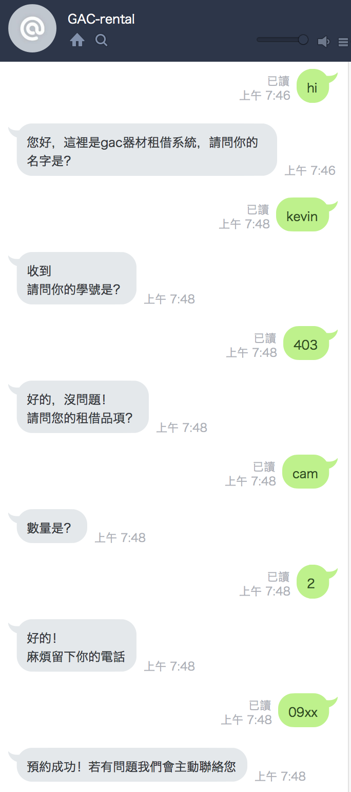
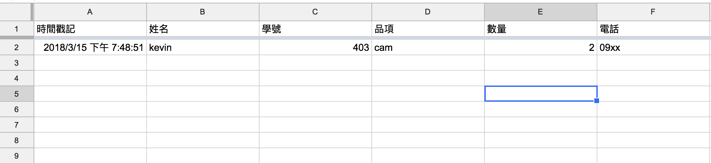

# line-bot-as-google-sheets
利用Node.js+heroku+googlesheets-api+line-bot做的租借器材機器人

## Result

### line 對話結果呈現

### 到google-sheets查看是否新增



## License

the original code owned by LINE Corporation


```
Copyright 2016 LINE Corporation

LINE Corporation licenses this file to you under the Apache License,
version 2.0 (the "License"); you may not use this file except in compliance
with the License. You may obtain a copy of the License at:

  https://www.apache.org/licenses/LICENSE-2.0

Unless required by applicable law or agreed to in writing, software
distributed under the License is distributed on an "AS IS" BASIS, WITHOUT
WARRANTIES OR CONDITIONS OF ANY KIND, either express or implied. See the
License for the specific language governing permissions and limitations
under the License.
```
